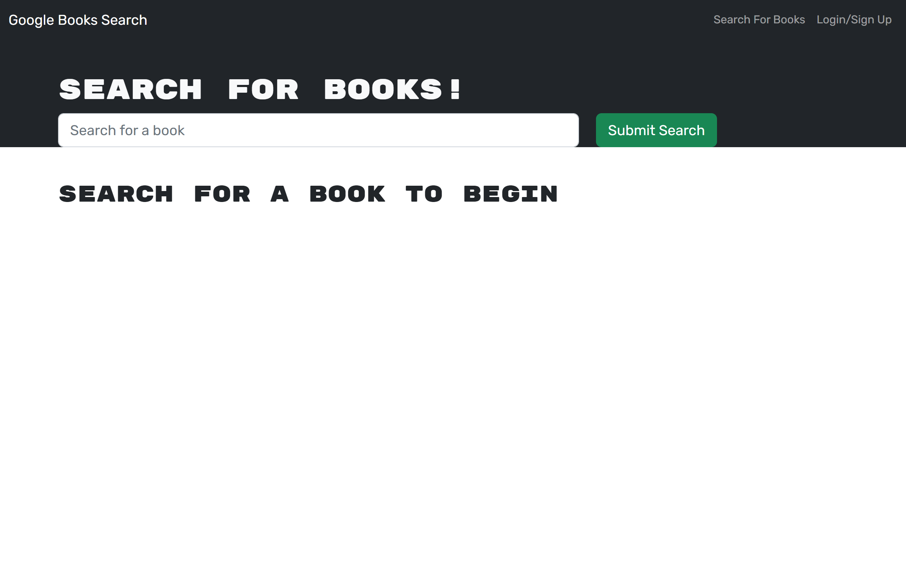
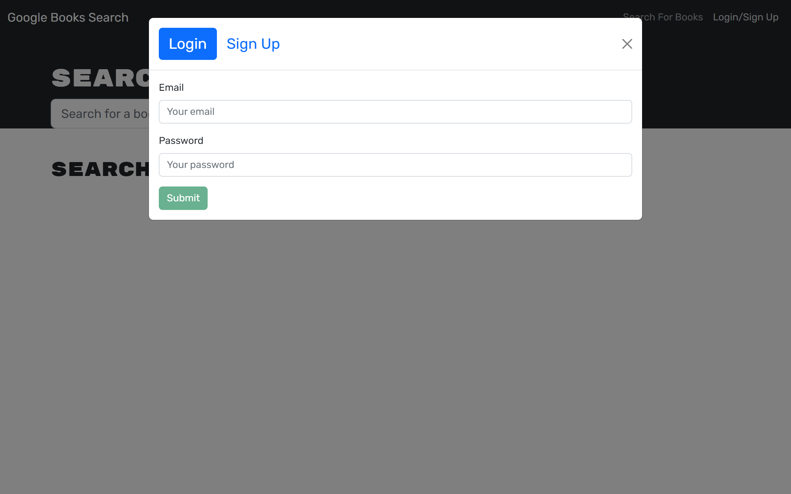

# Project Title: Book Search Engine Starter Code

## Description:
 This is a Google Books API-based search engine that enables a user to read new books.

## Installation:
  - Node.js
  - Express
  - Mongodb
  - React
  - GraphQl
  - Apollo-server-express
  - Apollo-client
  - JWT(jsonwebtoken)

## Usage:

The book search engine loads with a menu having a) Search for Books and b) Login/Signup options. It displays an input field to search for books and a submit button. Upon clicking on the Search for Books menu option, an input field to search for books and a submit button are provided.

The search option is independent of logging in. Search results are provided with book titles, author, description, image, and a link to that book on the Google Books site. Upon logging in, an additional option is provided to save books to the user's account. These saved books can be retrieved or removed whenever the users log-in. 

The Login/Signup menu option presents a modal on the screen with a log in or sign up toggle option. The Signup option presents three inputs for a) username, b) email address, and c) password, and a signup button appear. The Login option presents two inputs for a) email address and b) password and a login button. 

Therefore, an user account is created upon entering the required inputs and clicking the signup button. The user is allowed bo log in usign their account’s email address and password, and clicking on the login button. This closes the modal and logs the user in. 

The menu options change after logging in, and displays 'Search for Books', 'See your books' (an option to see the user's saved books), and 'Logout' options. 

Upon clicking on the Logout button the user is loggd out of the site and presented with a menu with the 'Search for Books' and 'Login/Signup' options and an input field to search for books and a submit button. 

### The heroku deployed application is: 

https://agile-oasis-81224.herokuapp.com/ 

 The following screenshots demonstrate the website application.

   

   

   

## Credits:
  Thanks to Xander Rapstine (https://github.com/Xandromus) for providing rescources for this project.

## Questions?
  ### Reach me here: 
   My GitHub profile:   [veerak21](https://github.com/veerak21),

   My E-mail: pv.kallu@gmail.com.     